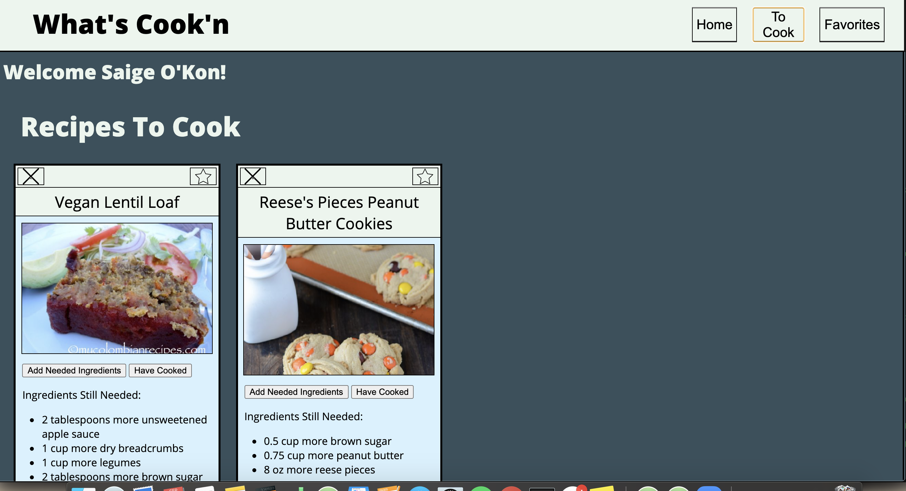
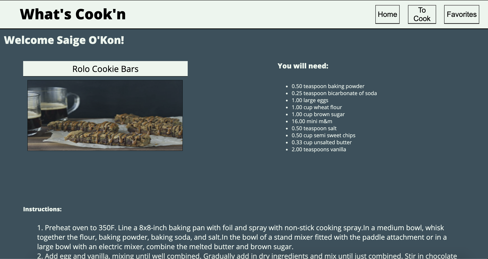

# Refactor Tractor

## What is this?
   This was a Mod 2 project for Turing's front end engineering program, exploring refactoring and interacting with a code base previous developers have built. This was our first time integrating webpack, fetch API, Sass, chair spies, and breaking our styling and JS functionality into various files. The goal was to take a code base intended to meet a [previous project spec](https://frontend.turing.io/projects/whats-cookin.html), and after matching the first spec follow outlines of [this next iteration](https://frontend.turing.io/projects/module-2/refactor-tractor-wc.html) to refactor and build upon the functionality.

## Who was involved?
[Stacy Potten](https://github.com/stacyp2006),  
[Nathaniel Millard](https://github.com/nathanielmillard),  
[Tim Keresey](https://github.com/timkeresey)

## How to use it?
The site is [deployed](https://nathanielmillard.github.io/whatsCookinRefactor/)
Otherwise getting into the code itself
- Clone Down This Repo
- Run NPM Install
- Run NPM Start to start your server
- Open [this link](http://localhost:8080/) in your browse
- Any edits are now live in real time

## Technologies Used
- Javascript
- html
- [Sass](https://sass-lang.com/)
- [Webpack](https://webpack.js.org/)
- [Lighthouse](https://developers.google.com/web/tools/lighthouse)
- [Fetch](https://developer.mozilla.org/en-US/docs/Web/API/Fetch_API)
- [Mocha](https://mochajs.org/)
- [Chai](https://www.chaijs.com/)
- [Chai Spies](https://www.chaijs.com/plugins/chai-spies/)

## How did it go?
   Generally speaking this project was a challenge: both in scope, time, and content in context of our previous work. There was a lot of room for small errors in one place trickling down farther away as we implemented more modular functionality. This was also the most difficult/inconsistent data we have handled, which inspired a lot of thinking on our toes and staying flexible. And generally there just was a steep learning curve on such a wide range of new concepts happening at once.
    That being said. For a project implementing so many new concepts, we are proud of the work we were able to get done. We excelled at dividing work and learning, so that one developer didn't have to self-teach every concept, but rather individual memebers could prelearn, and then teach the team. Every developer had time to indivdually problem solve, as well as plent of room to trouble shot as a team. And the project we have now, is a vast improvment of what was unzipped.

## Where can we go now?
   While this project isn't open for contributions, or expected to be maintained, with more time and interest there are a few features to consider
    - Better utilizing tags, while they are searchable, they aren't currently displayed.
    - A more flexible user interface, allowing a log in to the user knows "who they are", or even the ability to make a new user
    - We also thought of having households, and users could be extended child classes of this parent class. This would allow users to inherit a pantry and pantry methods, while individuals could have different favorite recipes than one another and new unique values and methods given that.

## In Action:

#### Home Page

#### Favorites Page

#### To Cook Page

#### Recipe Info Page

#### Search

#### Tab Through Site

